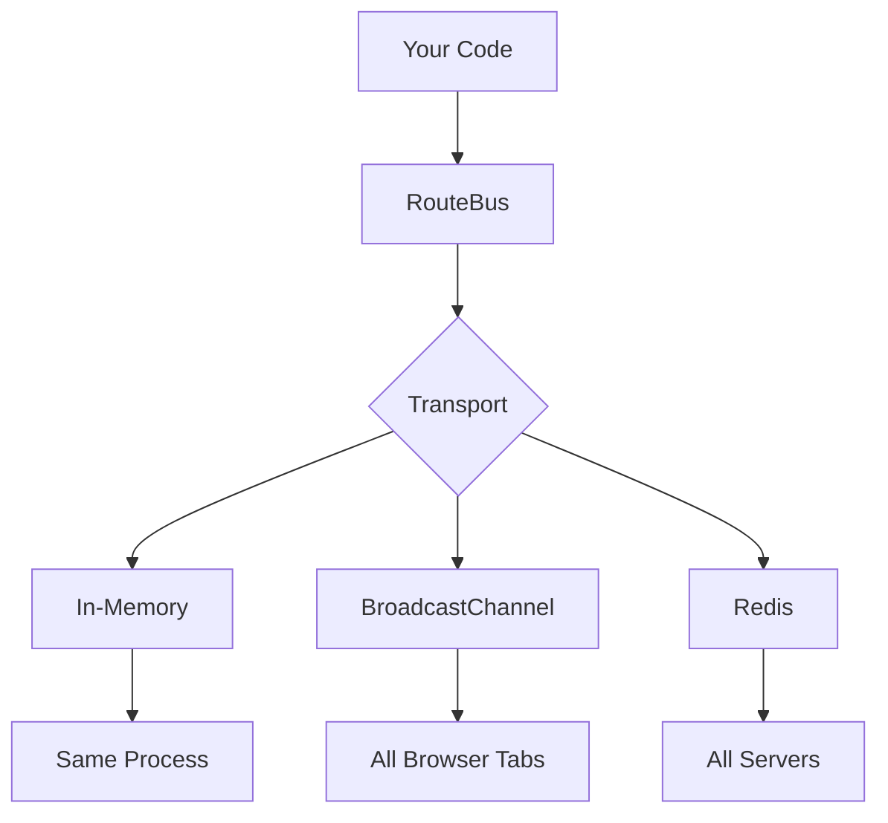

I keep writing the same pub/sub code in every project.
<br></br>

A thing happens. Other things need to know. So I create an event emitter. Then I realize I want type safety. Then I need it to work across browser tabs. Then across services. Then I am maintaining three different implementations that do almost the same thing.
<br></br>

So I built [RouteBus](https://github.com/Cr0wn-Gh0ul/RouteBus) to stop doing that.
<br></br>

---

## The idea

One event bus interface. Pluggable transports underneath. Start simple, scale up without rewriting code.
<br></br>

```ts
import { createRouteBus } from 'routebus';

type AppEvents = {
  "chat:message": { id: string; text: string; from: string };
  "user:login": { userId: string };
};

const bus = createRouteBus<AppEvents>();

bus.on("chat:message", (payload) => {
  console.log(`${payload.from}: ${payload.text}`);
});

bus.emit("chat:message", {
  id: "1",
  text: "Hello!",
  from: "Alice"
});
```
<br></br>

TypeScript autocompletes the event names. Try to emit with the wrong payload type and you get a compile error, not a runtime bug.
<br></br>

---

## Why transports matter

The default transport is in-memory. Events stay in the current process. Fine for most things.
<br></br>

But then you need cross-tab sync. Or you are building a multi-server app. Same events, different plumbing.
<br></br>


<br></br>

**BroadcastChannel** for browser tabs:
```ts
import { createRouteBus, createBroadcastChannelTransport } from 'routebus';

const bus = createRouteBus<AppEvents>({
  transport: createBroadcastChannelTransport<AppEvents>({
    channelName: 'my-app-events',
  }),
});

// Emit in one tab, all tabs receive it
bus.emit("counter:update", { value: 42 });
```
<br></br>

**Redis** for distributed systems:
```ts
import { createRouteBus, createRedisTransport } from 'routebus';
import Redis from 'ioredis';

const bus = createRouteBus<AppEvents>({
  transport: createRedisTransport<AppEvents>({
    redisClient: new Redis(),
    channelPrefix: 'myapp:',
  }),
});

// Events now work across all connected processes
bus.on("task:created", (payload) => processTask(payload));
```
<br></br>

Same `bus.on`, same `bus.emit`. The transport handles where the events actually go.
<br></br>

---

## Type safety that catches things

This is the part I cared about most.
<br></br>

```ts
type Events = {
  "save": { id: string };
};

const bus = createRouteBus<Events>();

bus.emit("save", { id: "123" }); // ✓
bus.emit("save", { id: 123 });   // ✗ Error: id must be string
bus.emit("load", { id: "123" }); // ✗ Error: "load" is not a valid event
```
<br></br>

Event names autocomplete in the editor. Invalid payloads fail at compile time. No more "why is this undefined" debugging sessions.
<br></br>

---

## Event queuing

Sometimes you do not want to emit immediately. Batch processing, debouncing, whatever.
<br></br>

```ts
for (const item of largeDataset) {
  bus.enqueue("data:process", item);
}

// Process in batches
bus.drain((event, payload) => {
  database.insert(payload);
});
```
<br></br>

`enqueue` buffers the events. `drain` processes them with whatever logic you want. Simple, but it covers most of the cases where I would otherwise reach for a queue library.
<br></br>

---

## Custom transports

If the built-in transports do not fit, you can write your own:
<br></br>

```ts
import type { Transport, EventHandler } from 'routebus';

function createMyTransport<T extends Record<string, any>>(): Transport<T> {
  return {
    async publish<K extends keyof T>(event: K, payload: T[K]) {
      // Send the event somewhere
    },
    
    subscribe<K extends keyof T>(event: K, handler: EventHandler<T[K]>) {
      // Listen for events, return unsubscribe function
      return () => { /* cleanup */ };
    },
    
    close() {
      // Optional cleanup
    },
  };
}
```
<br></br>

Three methods. That is the whole interface. I have used this to wire up WebSocket connections and custom message queues without touching the rest of the app.
<br></br>

---

## What I actually use it for

**UI state sync across tabs.** User logs in on one tab, all tabs update. No localStorage polling.
<br></br>

**Decoupling modules.** Instead of direct imports, modules just emit and listen. Easier to test, easier to swap things out.
<br></br>

**Microservice communication.** Same event definitions shared across services. Redis transport underneath. Type safety end to end.
<br></br>

---

## The tradeoffs

It is zero dependencies and tree-shakeable, but it is not trying to be a full message queue. No persistence, no guaranteed delivery, no dead letter queues. If you need that, use an actual message broker.
<br></br>

But for the 90% of cases where you just need "thing happened, other things should know", this is the tool I reach for now.
<br></br>

---

## Links

RouteBus: https://github.com/Cr0wn-Gh0ul/RouteBus  
npm: https://www.npmjs.com/package/routebus
