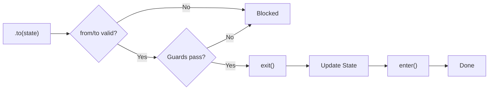

State machines are one of those patterns that sound academic until you actually need one.
<br></br>

A form wizard with validation between steps. A connection that can be connecting, connected, disconnecting, or error. A game character that can be idle, walking, jumping, or dead, and dead should not transition to jumping.
<br></br>

Every time I reach for a state machine library, I end up fighting it. Too much boilerplate, weird DSL, or a 50KB bundle for something that should be simple.
<br></br>

So I built [PhaseState](https://github.com/Cr0wn-Gh0ul/PhaseState).
<br></br>

---

## What it looks like

```ts
import { machine } from 'phasestate';

const loader = machine("idle", { count: 0 })
  .when("idle", {
    enter: () => console.log("Ready"),
    to: ["loading"]
  })
  .when("loading", {
    enter: async () => {
      console.log("Fetching...");
      await fetchData();
    },
    from: ["idle"],
    to: ["success", "error"]
  })
  .when("success", {
    enter: (ctx) => console.log("Done!", ctx.count),
    from: ["loading"]
  })
  .when("error", {
    from: "*",
    to: ["idle"]
  });

await loader.to("loading");
```
<br></br>

Define states with `.when()`. Transition with `.to()`. The `from` and `to` constraints say which transitions are allowed. That is mostly it.
<br></br>


<br></br>

---

## Guards

Sometimes a transition depends on more than just the current state.
<br></br>

```ts
loader.can("loading", state => state.context.count < 100);
```
<br></br>

Now `.to("loading")` only works if `count < 100`. Guards stack. If any guard returns false, the transition is blocked.
<br></br>

You can check what transitions are currently valid:
```ts
loader.transitions(); // ['loading'] or [] depending on guards
```
<br></br>

---

## Async everything

Enter and exit handlers can be async. Transitions wait for them.
<br></br>

```ts
.when("loading", {
  enter: async (ctx) => {
    const data = await fetchData();
    // do something with data
  },
  exit: async () => {
    await cleanup();
  }
})
```
<br></br>

This is the thing I always had to hack around in other libraries. Here it just works.
<br></br>

---

## Context

State machines often need to carry data. That is what context is for.
<br></br>

```ts
const form = machine("step1", { 
  email: "", 
  password: "", 
  isValid: false 
});

// Update context without changing state
form.set({ email: "user@example.com" });

// Update context during transition
await form.to("step2", { isValid: true });

// Or with a function
await form.to("step2", ctx => ({ ...ctx, step: 2 }));
```
<br></br>

TypeScript infers the context shape. Try to set a field that does not exist and you get a compile error.
<br></br>

---

## Snapshots and history

Sometimes you need to save and restore state. Or go back.
<br></br>

```ts
// Snapshot current state
const snapshot = form.snapshot();
// { state: 'step2', context: { email: '...', ... } }

// Later, restore it
form.restore(snapshot);

// Or just go back one step
await form.back();
```
<br></br>

History is capped at 10 states by default. Enough for undo, not enough to leak memory.
<br></br>

---

## Sequences

For scripted flows, you can run a sequence of transitions:
<br></br>

```ts
await loader.run([
  { to: "loading" },
  { to: "success", delay: 1000 },
  { to: "idle", update: { count: 0 } }
]);
```
<br></br>

Each step can have a delay. Useful for animations, testing, or anything with timing.
<br></br>

Or use the generator for step-by-step control:
```ts
const steps = loader.steps();
steps.next(); // initial state
steps.next({ to: "loading" });
steps.next({ to: "success" });
```
<br></br>

---

## Events

Subscribe to transitions:
<br></br>

```ts
const unsubscribe = loader.on(event => {
  if ('type' in event && event.type === 'transition') {
    console.log(`${event.from} → ${event.to}`);
    if (event.blocked) {
      console.log(`Blocked by: ${event.blocked}`);
    }
  }
});
```
<br></br>

You get both successful transitions and blocked attempts. Good for debugging, logging, or wiring up side effects.
<br></br>

---

## What I actually use it for

**Form wizards.** Multi-step forms where you cannot skip ahead, can go back, and need to validate between steps.
<br></br>

**Connection states.** WebSocket or API connections with proper handling of connecting, reconnecting, disconnected, error.
<br></br>

**UI modes.** Modal open/closed, drawer expanded/collapsed, but with rules about what can trigger what.
<br></br>

**Game logic.** Player states, enemy AI, anything where "what can happen next" depends on "what is happening now".
<br></br>

---

## The tradeoffs

Zero dependencies. Tiny bundle. Works in Node and browsers.
<br></br>

It is not trying to be XState. No visualizers, no actors, no parallel states. If you need those, use XState. If you need a state machine without the ceremony, this is the one I reach for.
<br></br>

---

## Links

PhaseState: https://github.com/Cr0wn-Gh0ul/PhaseState  
npm: https://www.npmjs.com/package/phasestate
