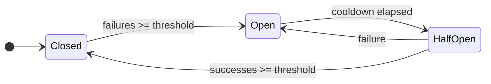

## Overview

Every app eventually meets *The Outside World*.
<br></br>
The Outside World is where "fetch" becomes:
- an API that is slow *sometimes*
- a dependency that is down *right now*
- a vendor that rate limits you for breathing too loudly
- a database that is fine until it is not  
<br></br>

When that happens, most systems fail in the dumbest possible way:
they keep trying, they keep waiting, they pile up threads/promises/jobs, and then they fall over from the weight.

That is what the circuit breaker pattern is trying to prevent.
<br></br>

Not "make errors go away".   
OR  
Not "magically heal outages".
<br></br>

Do: **stop repeatedly doing the thing that is currently on fire.**
<br></br>

---

## What a circuit breaker actually does



A circuit breaker is basically a tiny state machine in front of a risky call.
<br></br>
It has three moods:  

- **closed**: calls go through like normal  
- **open**: calls do *not* go through, you fail fast  
- **half-open**: you cautiously test the water to see if it recovered
<br></br>

That’s it. That’s the core idea.

The value is not just the fast failure, it is that it prevents **cascading failure**. If a dependency is dying, your app does not need to die with it.
<br></br>

---

## Pitfall 1: treating "retry" and "circuit breaker" like the same tool

Retry and circuit breaker are cousins, not twins.
<br></br>
- **Retry** is betting that the next attempt might succeed.
- **Circuit breaker** is admitting “this is probably doomed” and refusing to keep paying the cost.
<br></br>

Retries are great for *transient* failures (packet loss, short blips).
Retries are also a great way to DDoS your own dependencies if the outage is real.

<br></br>

```js
// Bad: retry everything, forever-ish, no timeout, no jitter
async function callWithRetries() {
  for (let attempt = 1; attempt <= 12; attempt++) {
    try {
      return await callVendor();
    } catch (error) {
      // every instance retries at the same rhythm -> herd behavior
      await sleep(250 * attempt);
    }
  }
  throw new Error("vendor failed after retries");
}
```
<br></br>
A breaker is the thing that says: "Stop. We will try later."
<br></br>

---

## Pitfall 2: counting the wrong failures

The breaker needs a signal. If your signal is garbage, your breaker becomes a random number generator.

Common mistakes:
- Counting **validation errors** as failures. That is not the dependency being down, that is you sending nonsense.
- Counting **404s** as failures. If the resource does not exist, your breaker should not "protect" you from reality.
- Not separating **rate limits** from **server errors**. Rate limiting is often recoverable, but your strategy might be "slow down" not "trip open".
<br></br>

The core question is always:
> "Does this failure mean the dependency is unhealthy, or does it mean my request is bad?"
{class="custom-blockquote"} 

<br></br>
```js
//Bad: every non-200 is treated like "dependency is unhealthy"
const response = await fetch(url);

if (!response.ok) {
  throw new Error(`status ${response.status}`);
}

// Better: only "dependency unhealthy" counts
if (res.status === 404) return null;
if (res.status === 429) throw new RateLimited();
if (res.status === 408 || res.status >= 500) {
  throw new Error(`status ${response.status}`);
}
else if (!res.ok) throw new BadRequest();
else ok();
```
<br></br>

If it is your request, do not teach your breaker to panic.
<br></br>

---

## Pitfall 3: no timeout means the breaker never gets a clean failure

This one is sneaky.

If requests hang, they do not fail. They just… sit there… forever… like a haunted loading spinner.
<br></br>
Your breaker needs calls to *resolve* so it can observe success or failure.
So you almost always want a timeout in the same neighborhood as the breaker.
<br></br>
Timeouts are the "this took too long, we are done here" boundary. 
Breakers are the "this keeps happening, we are not doing it again for a bit" boundary.
<br></br>
They work best as a pair.
<br></br>

```js
// Bad: hung requests never resolve, so you just stack more
async function getData() {
  const response = await fetch(url); // could hang a long time
  return response.json();
}

await Promise.all(Array.from({ length: 500 }, () => getData())); // pile-up
```
<br></br>

---

## Pitfall 4: flappy breakers

If your cooldown is too short, you get this loop:

1. dependency is sick  
2. breaker opens  
3. cooldown ends  
4. breaker goes half-open  
5. dependency is still sick  
6. breaker opens again  
7. repeat until everyone is exhausted
<br></br>

The breaker is doing its job, but you still get noisy logs, noisy alerts, and your system is spending its time poking a wound.
<br></br>

A good cooldown is long enough that the dependency has a chance to recover, and short enough that you are not stuck failing fast forever.
<br></br>

There is no universal number, but "10 seconds" is usually not a magic spell. It is just a number people type because it looks reasonable.
<br></br>

```js
// Bad: opens fast, probes constantly, "recovers" instantly
createCircuitBreaker({
  failureThreshold: 1,
  successThreshold: 1,
  cooldownMs: 500,
});
```
<br></br>

---

## Pitfall 5: "we added a circuit breaker" *(but you really didn’t)*

This happens in serverless and horizontally scaled systems a lot.
<br></br>

If every instance has its own breaker state, and traffic is spread across many instances, you can end up with:
- no single breaker seeing enough consecutive failures to trip  
- or half your instances tripped and half not, which is chaos with extra steps
<br></br>

The pattern still helps per instance, but you need to understand what you actually built:
a local safety mechanism, not a globally consistent guardian angel.
<br></br>

If you want shared breaker state, that becomes a different design problem.
<br></br>

```js
// Bad: new circuit breaker per call, so it has no memory
async function handler(request: Request) {
  const circuitBreaker = createCircuitBreaker({ failureThreshold: 3, cooldownMs: 30_000 });
  return circuitBreaker.wrap(() => callDependency(request))();
}
```
<br></br>

---

## Pitfall 6: no fallback plan

An open circuit is not a fix, it is a choice.
<br></br>

If you open the circuit and then just throw a 500, all you did was make your failure faster (which is still sometimes good, to be fair).
<br></br>

The real win is when you already know what to do during the open state:
- return cached data
- return partial data
- degrade the UI
- queue work for later
- serve a stale result with a warning
<br></br>

A circuit breaker without a fallback is like buying a fire extinguisher and storing it in a different building.
<br></br>

```js
// Bad: open circuit = fast failure, nothing else
return await callProtected(); // throws -> user suffers

// Better: stale cache fallback
try { return await callProtected(); }
catch { return cache.get("key") ?? renderFallback(); }
```
<br></br>

---

## Solution

Think of these as three separate knobs:
<br></br>

1. **Timeout**: "this single attempt has a max cost"
2. **Retry**: "this failure might be transient"
3. **Circuit breaker**: "this dependency might be unhealthy, stop hammering it"
<br></br>

They stack nicely, but only if they agree on what counts as "retryable" vs "breaker worthy".
<br></br>

---

## BreakerKit

I wrote a library called **BreakerKit** mainly because I wanted these primitives to be small and composable:
`withTimeout`, `retry`, and `circuitBreaker`.

<br></br>
```ts
import {
  circuitBreaker,
  retry,
  withTimeout,
  CircuitOpenError,
  TimeoutError,
} from "breakerkit";

// Wrap the risky call with a breaker.
// Put a timeout inside so hangs turn into real failures.
const resilientFetchJson = circuitBreaker(
  (url: string) =>
    withTimeout(() => fetch(url).then((r) => r.json()), 5_000),
  {
    failureThreshold: 3,
    cooldownMs: 30_000,
  }
);

export async function getData(url: string) {
  return retry(() => resilientFetchJson(url), {
    retries: 3,
    // This matters: if the circuit is open, do not retry the refusal.
    shouldRetry: (err) => !(err instanceof CircuitOpenError),
  });
}

async function demo() {
  try {
    const data = await getData("https://api.example.com/data");
    console.log(data);
  } catch (err) {
    if (err instanceof TimeoutError) {
      console.log("Slow dependency. Timeouts are doing their job.");
    }
    if (err instanceof CircuitOpenError) {
      console.log("Dependency is unhealthy. Circuit is open. Use fallback here.");
    }
    throw err;
  }
}
```
<br></br>
BreakerKit’s breaker defaults and options are straightforward: `failureThreshold`, `successThreshold`, `cooldownMs`, plus an `onStateChange` callback so you can log/alert when it opens.

That last part is important. If you do not observe state transitions, you will ship a breaker and then forget it exists until it ruins your graphs.

<br></br>

---
## Final thoughts

The circuit breaker pattern is simple, but the consequences aren’t.
<br></br>

- It is not a "reliability feature" system addon.
- It is a statement about how your system behaves under stress.
- If you count the wrong failures, you trip when you shouldn’t.
- If you skip timeouts, you never trip at all.
- If you retry everything, you amplify outages.
- If you add a breaker with no fallback, you just fail faster and call it architecture.
<br></br>

Still worth it. Just respect it a little.

<br></br>

---

## Links 

BreakerKit repo: https://github.com/Cr0wn-Gh0ul/BreakerKit  
BreakerKit on npm: https://www.npmjs.com/package/breakerkit