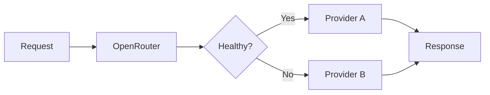
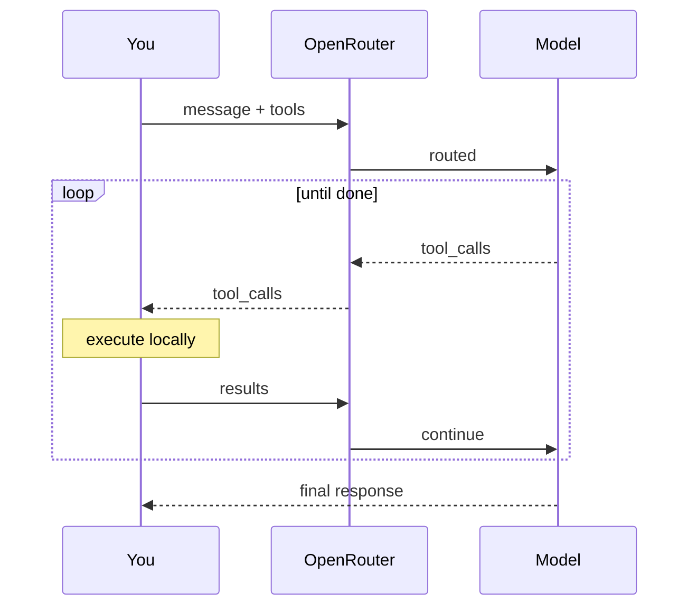

## Why?
I have been jumping between AI models a lot lately.
<br></br>

Claude for some things. GPT for others. Gemini when I want to see if Google figured it out yet. Llama when I want something local-ish. And every time I switch, it is a different SDK, different auth, different request shape, different "why is this field named slightly differently" moment.
<br></br>

At some point I found [OpenRouter](https://openrouter.ai/) and ended up going pretty deep. Deep enough that I built a terminal client for it. This is what I learned along the way.
<br></br>

---

## What is it?

One API. One key. 300+ models from 60+ providers behind it.
<br></br>

OpenRouter has its own SDK. Install it, give it your key, pick a model.
<br></br>

```ts
import { OpenRouter } from '@openrouter/sdk';

const openRouter = new OpenRouter({
  apiKey: process.env.OPENROUTER_API_KEY,
});

const completion = await openRouter.chat.send({
  model: 'anthropic/claude-sonnet-4',
  messages: [{ role: 'user', content: 'hello' }],
});
```
<br></br>

That is Claude. Want Gemini? Change the string. Want Llama? Change it again. Same everything else.
<br></br>

Simple enough. But the interesting part is what happens underneath.
<br></br>

---

## It is a router, not a proxy

I expected OpenRouter to just forward requests. It does more than that.
<br></br>

When a request comes in, it picks which provider to hit based on real-time health data. If a provider is slow or erroring, traffic shifts away. If it dies completely, you fail over automatically. No retry logic on your side, no code changes.
<br></br>


<br></br>

The default strategy weighs providers by price (cheaper = more likely) but deprioritizes anyone flaky in the last 30 seconds. Cost optimization and reliability, same decision.
<br></br>

This is the kind of thing you normally build yourself. Circuit breakers, health checks, fallback chains. Here it just happens.
<br></br>

---

## The knobs

Once I understood the routing, I started poking at the overrides.
<br></br>

Sort by throughput instead of price:
```ts
provider: { sort: 'throughput' }
```
<br></br>

Pin to specific providers:
```ts
provider: { order: ['together', 'deepinfra'], allowFallbacks: false }
```
<br></br>

Exclude providers that keep your data:
```ts
provider: { dataCollection: 'deny' }
```
<br></br>

Set latency thresholds with percentile cutoffs. "Only route to providers where p90 latency is under 2 seconds." That kind of thing.
<br></br>

Most of these I will never touch. But knowing they exist changes how I think about it. It is not just "model access", it is a routing layer I can tune when I need to.
<br></br>

---

## Structured outputs

I hate parsing LLM responses. "Here is the JSON you asked for:" followed by markdown code fences. Or worse, mostly-valid JSON with a trailing comma that breaks everything.
<br></br>

OpenRouter supports strict JSON schema validation. Define the shape, get that shape back.
<br></br>

```ts
const response = await openRouter.chat.send({
  model: 'anthropic/claude-sonnet-4',
  messages: [{ role: 'user', content: 'Extract the entities' }],
  responseFormat: {
    type: 'json_schema',
    jsonSchema: {
      name: 'entities',
      strict: true,
      schema: {
        type: 'object',
        properties: {
          people: { type: 'array', items: { type: 'string' } },
          places: { type: 'array', items: { type: 'string' } },
        },
        required: ['people', 'places'],
        additionalProperties: false,
      },
    },
  },
});
```
<br></br>

Set `strict: true` and the model has to match the schema exactly. No hallucinated fields, no missing required properties. It works across GPT, Claude, Gemini, most open-source models.
<br></br>

For the models that occasionally still mess up the formatting, there is a response healing plugin that automatically fixes malformed JSON before it reaches you.
<br></br>

---

## Prompt caching

This one surprised me. Prompt caching is not new, but the way OpenRouter handles it across providers is.
<br></br>

For providers with automatic caching (OpenAI, DeepSeek, Gemini), it just works. Same prompt prefix, cheaper tokens. No config.
<br></br>

For Anthropic, you mark what to cache:
```ts
{
  role: 'system',
  content: [
    { type: 'text', text: 'You are an expert on this codebase:' },
    { 
      type: 'text', 
      text: HUGE_CODEBASE_DUMP,
      cache_control: { type: 'ephemeral' }
    }
  ]
}
```
<br></br>

Cache writes cost a bit more. Cache reads cost 90% less. For long conversations with a big system prompt, the savings add up fast.
<br></br>

The clever part: OpenRouter tries to keep routing to the same provider when you have a warm cache. If that provider goes down, you fail over and rebuild the cache elsewhere. Invisible.
<br></br>

Every response tells you exactly what happened:
```ts
usage: {
  prompt_tokens: 10339,
  prompt_tokens_details: {
    cached_tokens: 10318,  // cache hit
    cache_write_tokens: 0
  }
}
```
<br></br>

---

## Web search built in

Some prompts need current information. "What happened yesterday" does not work with a model trained six months ago.
<br></br>

OpenRouter has a web search plugin. Append `:online` to any model:
```ts
model: 'anthropic/claude-sonnet-4:online'
```
<br></br>

Or configure it explicitly:
```ts
plugins: [{
  id: 'web',
  max_results: 5,
  engine: 'native'  // or 'exa'
}]
```
<br></br>

For Claude, GPT, and Perplexity models, it uses their native search. For everything else, it falls back to Exa. Either way, same interface.
<br></br>

The response includes citations with URLs, so you can trace where the information came from. Costs a few cents per request on top of the normal token costs.
<br></br>

---

## Context overflow handling

Long conversations eventually hit the context limit. Usually that means truncating history or crashing.
<br></br>

OpenRouter has a `middle-out` transform that compresses prompts automatically:
```ts
transforms: ['middle-out']
```
<br></br>

It removes messages from the middle of the conversation, keeping the beginning (system prompt, initial context) and the end (recent messages). Based on the research that LLMs pay less attention to the middle anyway.
<br></br>

For models with 8k context or less, this is enabled by default. For larger models, you opt in. Not perfect recall, but better than failing.
<br></br>

---

## Tool calling that actually works

Every AI API "supports" tools now. But they all do it slightly differently, and half the time you hit a provider that silently ignores them or returns them in some weird shape.
<br></br>

OpenRouter normalizes this. Same schema regardless of model. And when you include `tools` in your request, it only routes to providers that actually support them. No silent failures.
<br></br>


<br></br>

Send tools, get back a tool call, execute it yourself, send results, get final answer. Now it works the same way across Claude, GPT, Gemini, Llama, whatever.
<br></br>

---

## Usage accounting

Every response includes a `usage` object. Token counts, costs, caching stats, reasoning tokens if the model uses them.
<br></br>

```ts
usage: {
  prompt_tokens: 194,
  completion_tokens: 87,
  total_tokens: 281,
  cost: 0.00042,
  prompt_tokens_details: {
    cached_tokens: 150,
    cache_write_tokens: 0
  },
  completion_tokens_details: {
    reasoning_tokens: 0
  }
}
```
<br></br>

No separate API call to check costs. No waiting for a dashboard to update. It is right there in the response.
<br></br>

For streaming, the usage comes in the final chunk. For async auditing, you can also fetch it later using the generation ID. I used this to build the cost tracking in my terminal client without any external lookups.
<br></br>

---

## I built a thing

After enough time in the docs, I wanted to actually use this from my terminal. Not a web UI, not a notebook. Just a shell I could open, pick a model, and start working.
<br></br>

So I built [OpenRouter Terminal](https://github.com/Cr0wn-Gh0ul/OpenRouter-Terminal).
<br></br>

```bash
npm install -g openrouter-terminal
openrouter
```
<br></br>

It is a CLI that wraps OpenRouter into an interactive chat with some extras:
<br></br>

- **Model switching.** `model anthropic/claude-sonnet-4` and you are there.
- **File context.** `context src/` and now the AI knows what you are working on.
- **File editing with undo.** The AI can read, write, and edit files. Every change is tracked. One command to revert.
- **Custom tools.** Drop a JS module, load it, and the AI can call it. Same function calling flow, wired into a loop.
- **Session branching.** Go back to any point in the conversation and take a different path. Like git for chat history.
- **Cost tracking.** Every message shows tokens and cost. No dashboard required.
The undo system was the thing I cared about most. If an AI is touching my files, I need a quick way back.
<br></br>

---

## What stuck with me

**The routing is the product.** OpenRouter is not hosting models. Anthropic and Google are doing that. OpenRouter's job is deciding which provider to hit, when to fail over, how to balance cost and speed. That decision layer is harder than it looks.
<br></br>

**Structured outputs change how you architect.** When you can trust the response shape, you stop writing defensive parsing code. You define a schema, get valid JSON, move on. The code gets smaller.
<br></br>

**Caching is invisible until you need it.** I did not think about prompt caching until I started doing multi-turn conversations with big system prompts. Suddenly 90% cheaper reads matter. And not having to manage it myself matters more.
<br></br>

**Tool calling is where the leverage is.** Text in, text out is fine. But the model deciding *what* to do while you decide *how* to do it is the difference between a chatbot and something that can actually change things.
<br></br>

**Streaming is non-negotiable.** Waiting for a full response from a big model is miserable. OpenRouter streams across providers, which made the terminal client feel responsive.
<br></br>

**Cost visibility matters.** Bouncing across providers with different pricing, you want to know what each message costs. OpenRouter gives you that in the response. I surfaced it in the CLI because I wanted to see it without opening a browser.
<br></br>

**The abstraction layer is worth it.** I could wire up each provider directly. I have done it before. But then I am maintaining auth for each one, handling their different error formats, building my own fallback logic. OpenRouter is the "I do not want to think about this" layer, and that is exactly what I wanted.
<br></br>

---

## Links

OpenRouter: https://openrouter.ai/  
OpenRouter Terminal: https://github.com/Cr0wn-Gh0ul/OpenRouter-Terminal
