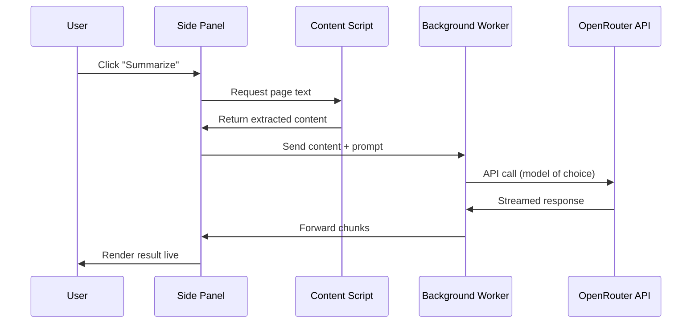

Got tired of copy-pasting articles into ChatGPT. So I made a Chrome side panel that does it for me.
  

[Browser Sage](https://github.com/Cr0wn-Gh0ul/BrowserSage) sits in your browser's side panel. Click it, pick what you want (summary, analysis, chat, verify), and it pulls the page content and sends it to whatever model you want through OpenRouter.
  

The whole point of using OpenRouter is model choice. Not locked into GPT-4 or Claude. You get access to 600+ models, swap between them in settings, compare outputs. Want to run the same page through Llama, Mistral, and Claude to see who hallucinates less? Go for it.
  

---

## How It Works

  

Content script grabs the page text. Side panel builds the prompt. Background worker holds your API key and makes the actual call. Nothing clever, just clean separation so your key never touches the page context.
  

---

## Features

### Chat
Multi-turn conversation about the current page. Ask follow-ups, dig deeper into specific sections, or just have a discussion about what you're reading. Context persists across turns so the model remembers what you've already talked about.
  

### Summary
Generate a TL;DR of the page along with key points. Also identifies what's missing — gaps in the article's coverage, questions left unanswered, topics briefly mentioned but not explored.
  

### Analysis
Extract claims from the content and identify weak spots in the reasoning. Flags unsupported assertions, logical inconsistencies, and suggests follow-up questions worth investigating.
  

### Signals
Detect AI-writing patterns in the text. These are indicators, not verdicts — heuristics that flag stylistic markers commonly associated with AI-generated content. Take them as data points, not conclusions.
  

### Verify
Fact-check claims made in the article. Assesses source credibility based on available information and generates cross-reference search queries you can use to validate claims independently.
  

### Usage Tracking
Monitor your token usage and OpenRouter credits directly in the extension. Keep an eye on costs without leaving the browser.
  

---

## Screenshots














  

---

## Stack

React 18, TypeScript, TailwindCSS, Vite. Uses `@openrouter/sdk` for the API calls. Manifest V3 because Chrome made us.
  

---

## Security Note

Your API key lives in `chrome.storage.local`. Content scripts can't see it. Only the background service worker touches the network. Page content goes out, responses come back, key stays safe.
  

---

## [GitHub Link](https://github.com/Cr0wn-Gh0ul/BrowserSage)
