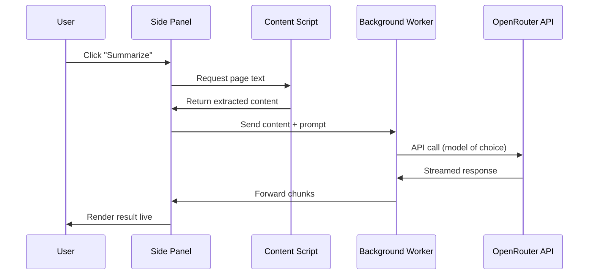

Got tired of copy-pasting articles into ChatGPT. So I made a Chrome side panel that does it for me.
  

[ScryPanel](https://github.com/Cr0wn-Gh0ul/ScryPanel) sits in your browser's side panel. Click it, pick what you want (summary, analysis, chat), and it pulls the page content and sends it to whatever model you want through OpenRouter.
  

The whole point of using OpenRouter is model choice. Not locked into GPT-4 or Claude. You get access to 600+ models, swap between them in settings, compare outputs. Want to run the same page through Llama, Mistral, and Claude to see who hallucinates less? Go for it.
  

---

## How It Works

  

Content script grabs the page text. Side panel builds the prompt. Background worker holds your API key and makes the actual call. Nothing clever, just clean separation so your key never touches the page context.
  

---

## The Modes

**Chat** — Talk to the page. Ask follow-ups. It keeps context across turns.

**Summary** — TL;DR, key points, and a list of what the article doesn't cover.

**Analysis** — Pulls out claims, flags weak reasoning, suggests questions worth asking.

**Signals** — Runs some heuristics for AI-written text. Not a detector, just indicators.
  

---

## Screenshots












  

---

## Stack

React, TypeScript, TailwindCSS, Vite. Uses `@openrouter/sdk` for the API calls. Manifest V3 because Chrome made us.
  

---

## Security Note

Your API key lives in `chrome.storage.local`. Content scripts can't see it. Only the background service worker touches the network. Page content goes out, responses come back, key stays safe.
  

---

[GitHub](https://github.com/Cr0wn-Gh0ul/ScryPanel)
